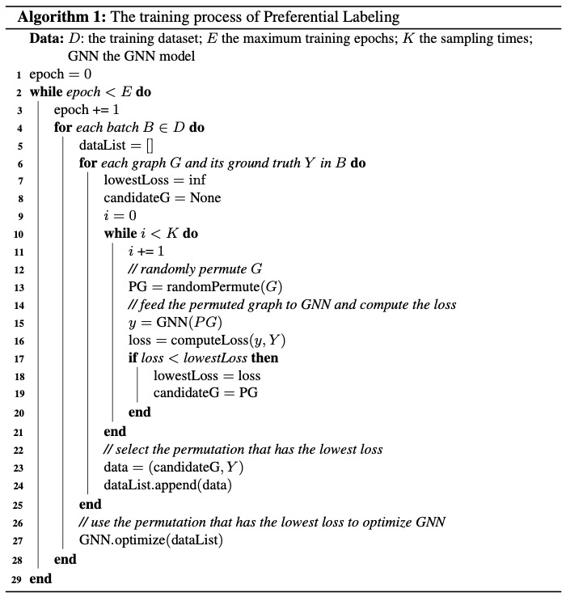
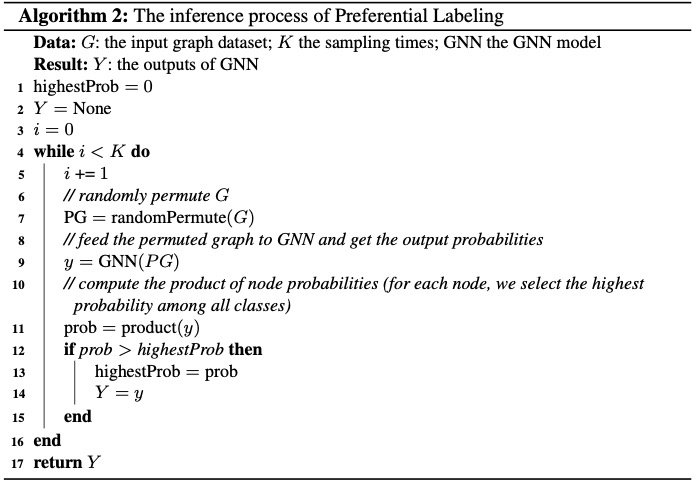

## Pseudo-Code

### Training:

### Inference:

## Experimental Results under Different Settings

### Similar to Figure 4:

Error rate versus the number of random labelings
during inference. We compare the embedding strategies for
training, and all variants use the labeling with the maximum
predicted probability for inference. 

### Similar to Figure 5:

Error rate versus the number of random labelings
during both training and inference.

## Dependenices
* tensorflow 1.13.2
* pytorch  1.6.0
* networkx 2.2
